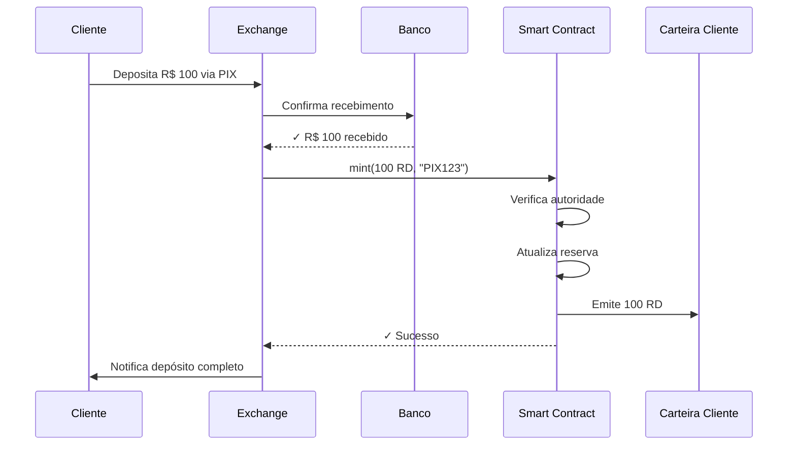
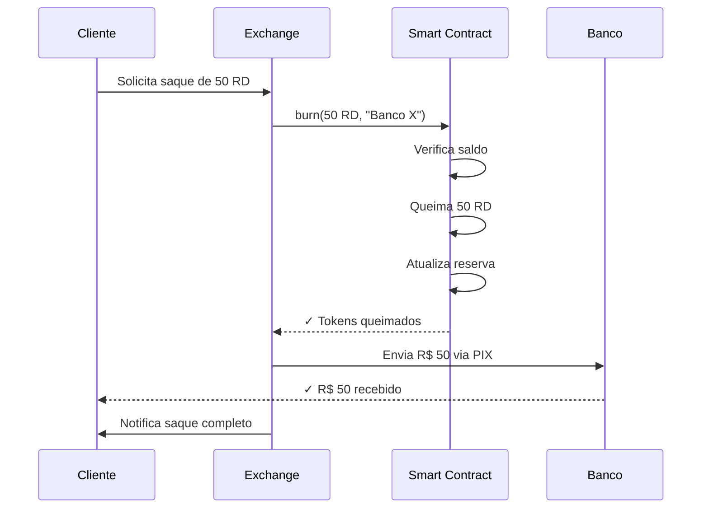

# Real Digital (RD) - Whitepaper

**Versão 1.0 - Dezembro 2025**

## Resumo Executivo

Real Digital é uma stablecoin descentralizada lastreada 1:1 com o Real brasileiro (BRL), construída na blockchain Solana. O projeto visa fornecer uma alternativa rápida, barata e transparente para transações em Real no ecossistema cripto, especialmente para aplicações de entretenimento online como cassinos e jogos.

## 1. Introdução

### 1.1 Problema

O mercado brasileiro de entretenimento online enfrenta desafios significativos:

- **Custos altos de transação**: Gateways de pagamento tradicionais cobram 2-5% por transação
- **Velocidade**: Transações bancárias podem levar horas ou dias
- **Chargebacks**: Risco de estorno prejudica operadores
- **Barreiras regulatórias**: Dificuldade em operar com BRL diretamente

### 1.2 Solução

Real Digital resolve esses problemas através de:

- ✅ **Custo ultra baixo**: R$ 0,001 por transação na Solana
- ✅ **Velocidade**: Confirmação em 3 segundos
- ✅ **Sem chargebacks**: Transações irreversíveis
- ✅ **Paridade garantida**: 1 RD = 1 BRL sempre

## 2. Arquitetura Técnica

### 2.1 Blockchain

**Solana** foi escolhida por:

| Métrica | Valor |
|---------|-------|
| TPS (transações/segundo) | 65.000+ |
| Custo médio por transação | $0.00025 (~R$ 0,001) |
| Tempo de confirmação | 400ms - 3s |
| Finalidade | Imediata (sem reorganizações) |

### 2.2 Padrão de Token

Real Digital utiliza o padrão **SPL Token** (Solana Program Library), equivalente ao ERC-20 do Ethereum.

**Especificações:**
- Nome: Real Digital
- Símbolo: RD
- Decimais: 2 (centavos)
- Tipo: Fungible Token
- Mintável: Sim (apenas autoridade)
- Queimável: Sim

### 2.3 Smart Contract

O contrato implementa as seguintes funções principais:

```rust
// Inicialização
pub fn initialize(decimals: u8) -> Result<()>

// Emissão (após confirmar depósito BRL)
pub fn mint_real_digital(amount: u64, deposit_proof: String) -> Result<()>

// Queima (quando usuário saca)
pub fn burn_real_digital(amount: u64, withdrawal_address: String) -> Result<()>

// Emergência
pub fn pause() -> Result<()>
pub fn unpause() -> Result<()>

// Governança
pub fn transfer_authority(new_authority: Pubkey) -> Result<()>
```

## 3. Mecanismo de Paridade 1:1

### 3.1 Como Funciona

A paridade **1 RD = 1 BRL** é mantida através de 3 pilares:

#### Pilar 1: Controle de Emissão

```
Cliente deposita R$ 100 via PIX
    ↓
Sistema confirma pagamento
    ↓
Smart contract emite 100 RD
    ↓
Reserva aumenta em R$ 100
    ↓
Cliente recebe 100 RD na carteira
```

**Garantia:** Cada RD emitido tem exatamente 1 BRL em reserva.

#### Pilar 2: Reserva Transparente

A reserva é composta por:

1. **Conta bancária** com saldo em BRL
2. **Registro on-chain** do total em circulação
3. **Auditoria pública** mensal

**Fórmula de verificação:**
```
Saldo Bancário (BRL) >= Total RD em Circulação
```

#### Pilar 3: Arbitragem de Mercado

Se o preço de mercado desviar:

**Cenário A: RD > R$ 1,00**
- Autoridade emite mais RD
- Oferta aumenta → Preço cai para R$ 1,00

**Cenário B: RD < R$ 1,00**
- Autoridade recompra RD
- Oferta diminui → Preço sobe para R$ 1,00

### 3.2 Por Que Não é Algorítmico?

Diferente de stablecoins algorítmicas (ex: UST/Terra), Real Digital **não depende de mecanismos de mercado complexos** para manter a paridade. É um modelo simples e comprovado:

- ✅ Lastro real em BRL (como USDT, USDC)
- ✅ Auditável e transparente
- ✅ Sem risco de "death spiral"

### 3.3 Comparação com Outros Modelos

| Modelo | Exemplo | Lastro | Risco de Depeg |
|--------|---------|--------|----------------|
| **Fiat-backed** | USDT, USDC, **RD** | Moeda fiduciária | Baixo |
| **Crypto-backed** | DAI | Criptomoedas | Médio |
| **Algorítmico** | UST (falhou) | Nenhum | Alto |

## 4. Fluxos Operacionais

### 4.1 Depósito (Mint)



### 4.2 Saque (Burn)



## 5. Segurança

### 5.1 Medidas Implementadas

1. **Autoridade única**: Apenas o endereço autorizado pode emitir tokens
2. **Limite por transação**: Máximo de 1 milhão de RD por mint
3. **Pausa de emergência**: Contrato pode ser pausado em caso de ataque
4. **Auditoria de código**: Smart contract será auditado antes do mainnet
5. **Multisig (futuro)**: Autoridade será transferida para multisig 2/3

### 5.2 Riscos e Mitigações

| Risco | Probabilidade | Impacto | Mitigação |
|-------|---------------|---------|-----------|
| Hack do smart contract | Baixa | Alto | Auditoria + Bug Bounty |
| Roubo da chave privada | Média | Alto | Multisig + Hardware wallet |
| Insolvência da reserva | Baixa | Alto | Auditoria mensal + Transparência |
| Ataque à Solana | Muito baixa | Médio | Diversificação futura (multi-chain) |

## 6. Governança

### 6.1 Fase Atual (Centralizada)

Durante o MVP, a governança é centralizada:

- **Autoridade**: Controlada pela equipe fundadora
- **Decisões**: Emissão, queima, pausas de emergência
- **Transparência**: Todas as operações são públicas on-chain

### 6.2 Fase Futura (DAO)

Roadmap para descentralização:

**Q2 2026:**
- Transição para multisig 2/3
- Criação do token de governança (RDG)

**Q4 2026:**
- Lançamento da DAO
- Votação on-chain para decisões críticas
- Distribuição de RDG para holders de RD

## 7. Casos de Uso

### 7.1 Cassinos Online

**Problema:** Custos altos de PIX (2-5%) + chargebacks

**Solução com RD:**
- Depósito: Cliente compra RD (custo: 0,06%)
- Jogo: Cliente usa RD no cassino (custo: R$ 0,001/TX)
- Saque: Cliente vende RD por BRL (custo: 1%)

**Economia:** ~70% de redução em custos

### 7.2 Transferências P2P

**Problema:** TED/PIX tem limites e horários

**Solução com RD:**
- 24/7/365
- Sem limites
- Confirmação em 3 segundos
- Custo: R$ 0,001

### 7.3 DeFi

**Futuro:** RD poderá ser usado em:
- Pools de liquidez (Raydium, Orca)
- Empréstimos (Solend)
- Yield farming
- Pagamentos cross-border

## 8. Tokenomics

### 8.1 Supply

- **Supply inicial**: 0 RD
- **Supply máximo**: Ilimitado (depende da demanda)
- **Supply atual**: Dinâmico (mint/burn conforme necessidade)

### 8.2 Distribuição

Não há "distribuição" tradicional. RD é emitido sob demanda:

```
Total RD em Circulação = Total Depositado - Total Sacado
```

### 8.3 Taxas

| Operação | Taxa | Destinação |
|----------|------|------------|
| Depósito (compra RD) | 0% - 0,5% | Operação da exchange |
| Saque (vende RD) | 1% - 2% | Operação da exchange |
| Transferência on-chain | R$ 0,001 | Validadores Solana |

## 9. Roadmap

### Q1 2026 - MVP
- [x] Smart contract desenvolvido
- [ ] Auditoria de segurança
- [ ] Deploy em devnet
- [ ] Testes internos

### Q2 2026 - Beta
- [ ] Deploy em mainnet
- [ ] Integração com exchange
- [ ] Primeiros 1.000 usuários
- [ ] Auditoria de reserva #1

### Q3 2026 - Produção
- [ ] Listagem em DEXs
- [ ] Integração com carteiras
- [ ] API pública
- [ ] 10.000+ usuários

### Q4 2026 - Expansão
- [ ] Governança DAO
- [ ] Token RDG
- [ ] Multi-chain (Polygon, BSC)
- [ ] Parcerias estratégicas

## 10. Equipe

*(A ser preenchido)*

## 11. Legal e Compliance

### 11.1 Status Regulatório

Real Digital **não é**:
- ❌ Moeda de curso legal
- ❌ Emitido pelo Banco Central
- ❌ Garantido pelo governo

Real Digital **é**:
- ✅ Token digital privado
- ✅ Lastreado em BRL
- ✅ Operado por entidade privada

### 11.2 Compliance

A operadora do Real Digital compromete-se a:

- ✅ KYC/AML para todos os usuários
- ✅ Relatórios de auditoria mensais
- ✅ Cooperação com autoridades
- ✅ Transparência total da reserva

## 12. Conclusão

Real Digital oferece uma solução prática, rápida e econômica para transações em Real no mundo cripto. Através de um modelo simples de lastro 1:1, transparência total e tecnologia de ponta (Solana), o projeto visa se tornar a stablecoin BRL de referência no ecossistema.

---

**Contato:**
- Email: contato@realdigital.io
- GitHub: github.com/ederziomek/real-digital-token

**Disclaimer:** Este whitepaper é um documento vivo e pode ser atualizado conforme o projeto evolui.
